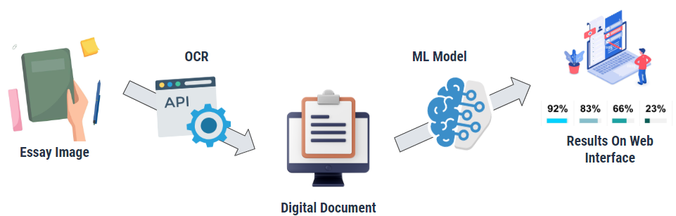
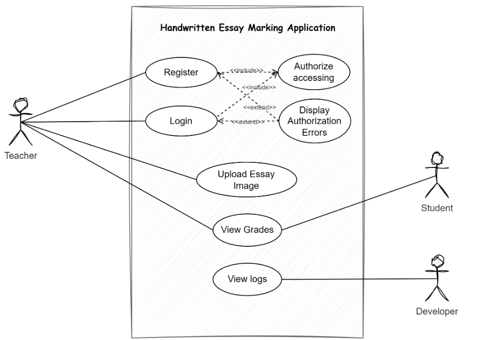
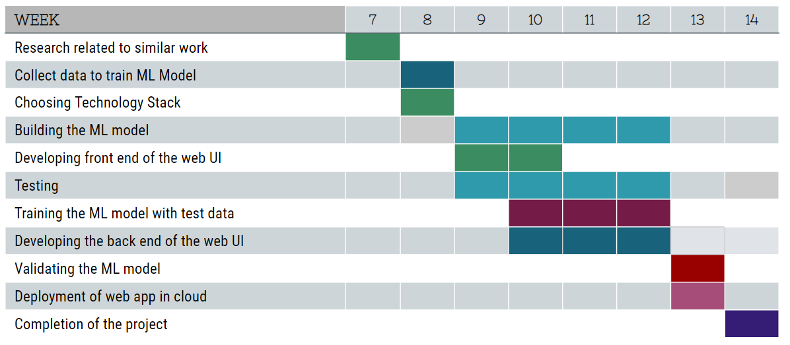

[comment]: # "This is the standard layout for the project, but you can clean this and use your own template"

# Handwritten Essay Marking Software

## Table of Contents

1. [Introduction](#introduction)
2. [Problem](#problem)
3. [Aim](#aim)
4. [Dataset](#dataset)
5. [High_Level_Solutions_Architecture_Digram](#high-level-solutions-architecture-diagram)
6. [Use_Case_Diagram](#use-case-diagram)
7. [Technology_Stack](#technology-stack)
8. [Machine_Learning_Algorithm](#machine-learning-algorithm)
9. [Project_Timeline](#project-timeline)
10. [Product Owner](#product-owner)
11. [Team Members](#team-members)
12. [Links](#links)

---

## Introduction

The Automated Essay Scoring (AES) program is used to assess and score essays that have been written in response to particular prompts. It is the procedure of employing computer programs to grade written essays. Since it motivates students to make incremental changes to their writing, automating the evaluation process may be advantageous for both instructors and students.

## Problem

The development of an ML-based Handwritten Essay marking software addresses several significant problems associated with manual essay grading. Firstly, manually marking numerous handwritten essays can be an overwhelming task for teachers and instructors. It often requires extensive time and effort to review each essay thoroughly and provide accurate feedback. This leads to the second problem, which is the time-consuming nature of the manual grading process. By automating the essay marking with machine learning algorithms, the software can significantly reduce the time required to evaluate and assess a large number of essays.

Another challenge in manual essay marking is the issue of inconsistency. Different markers may have varying interpretations and grading criteria, resulting in inconsistent scoring across multiple essays. With an ML-based software, the grading process can be standardized, ensuring consistent evaluation criteria are applied to each essay, leading to fair and reliable results.

Bias and human error are also common concerns in manual essay marking. Human markers can inadvertently introduce biases based on factors such as handwriting quality, gender, or race, which may affect the fairness and objectivity of the grading process. ML-based software, when trained on a diverse set of essays, can mitigate such biases and provide more impartial evaluations. Additionally, it reduces the likelihood of human error, such as calculation mistakes or overlooking important aspects of an essay, ensuring more accurate and precise grading.

## Aim

"Design and develop a web interface to automate the process of grading handwritten essays by leveraging machine learning algorithms while ensuring fairness and consistency in evaluations."

## Dataset

The dataset we are using is ‘The Hewlett Foundation: Automated Essay Scoring Dataset’ by ASAP. You can find it by clicking [here](https://www.kaggle.com/c/asap-aes/data)

## High Level Solutions Architecture Diagram

<!--  -->

## Use Case Diagram

<!--  -->

## Technology Stack

- Frontend - Angular
- Backend - Flask
- Optical Character Recognition API - Azure Cloudvision
- Database - MongoDB
- Project Management - Azure DevOps
- ML Development - Pandas, Scikit-learn, Keras, nltk, Numpy

## Machine Learning Algorithm

- Data Preprocessing
   * In the initial phase, we performed standard preprocessing steps, such as handling null values and selecting relevant features from the dataset. We addressed data skewness through normalization techniques and cleaned the essays by removing unnecessary symbols, stop words, and punctuation. Additional features, including sentence count, word count, character count, and average word length, were incorporated to improve accuracy. We also utilized part-of-speech tagging to extract noun, verb, adjective, and adverb counts, as well as identified misspelled words through corpus comparison. The refined dataset was then subjected to various machine learning algorithms for further analysis.
Processed dataset can be found in the file, **_Processed_data.csv_**

- Applying Machine Learning Algorithms
   * To prepare the data for machine learning algorithms, we used CountVectorizer to convert the essays into numeric form. Initially, we applied linear regression, SVR, and Random Forest without the additional features, resulting in high mean squared error. However, after including the extra features and reapplying CountVectorizer, the performance notably improved, particularly for Random Forest.

## Project Timeline

<!--  -->

## Product Owner
- Mr. Sampath Deegalla, [sampath@eng.pdn.ac.lk](mailto:sampath@eng.pdn.ac.lk)

## Team Members

- E/18/118, Haritha Gunarathna, [e18118@eng.pdn.ac.lk](mailto:e18118@eng.pdn.ac.lk)
- E/18/203, Shehan Madhusanka, [e18203@eng.pdn.ac.lk](mailto:e18203@eng.pdn.ac.lk)
- E/18/264, Prasanna N.W.G.L.M., [e18264@eng.pdn.ac.lk](mailto:e18264@eng.pdn.ac.lk)

## Links

- [Project Repository](https://github.com/cepdnaclk/{{ page.repository-name }}){:target="\_blank"}
- [Project Page](https://cepdnaclk.github.io/{{ page.repository-name}}){:target="\_blank"}
- [Department of Computer Engineering](http://www.ce.pdn.ac.lk/)
- [University of Peradeniya](https://eng.pdn.ac.lk/)

[//]: # "Please refer this to learn more about Markdown syntax"
[//]: # "https://github.com/adam-p/markdown-here/wiki/Markdown-Cheatsheet"
